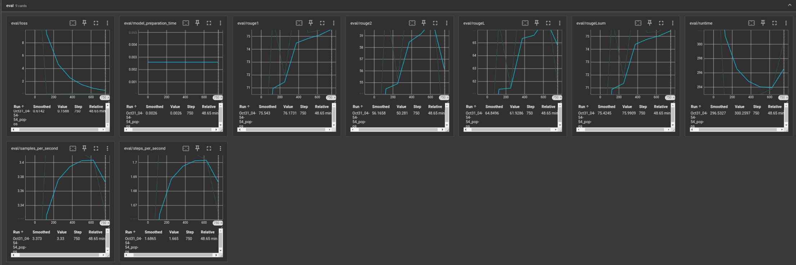

# squad-llm
A small LLM (T5-small) fine-tuned on a **SQuAD** dataset for an **Abstractive QA** task.

## Approach to solving the problem
Since the Abstractive QA (AQA) implies the generation of textual answers, instead of predicting their span in the input text as is the case in Extractive QA (EQA), it was clear that the chosen LLM needed to contain the Decoder block as well.
Hence, technically speaking, the AQA task is a kind of Text2Text, or Seq2Seq, task.
For this reason, smaller LLMs that could be regarded for solving task would include models such as: T5, mT5, FT5, BART, Llama 3.2 1B, GPT-Neo, MPT 1.3B, etc.
Since it's important for the model to properly utilize the context appended to each question, Encoder-Decoder models are better suited for this task because of the utilization of the Encoder block.
I.e. the Encoder blocks allows us to embed the inputs first to allow the model to better reason about the given context.
Additionally, since some of "older" LLMs (T5,BART, etc.) usually come in sizes much smaller than more novel Decoder-only models, the decision was made to choose a candidate from this group of models.
Precisely, the T5-small, which comes in size of about 60M paramteres, was the chosen model.
My previous experience with fine-tuning this model, the large number of datasets and tasks it was trained on, and its size were the top 3 deciding factors.

### Dataset

As already mentioned, the [google-t5/t5-small](https://huggingface.co/google-t5/t5-small) was fine-tuned on the SQuAD dataset available [here](https://huggingface.co/datasets/rajpurkar/squad).
To form the inputs to the model, a prompt similar to the one used by the authors of the T5 paper for the Trivia QA was used.  
The inputs to the model were thus formed as: `"question: {question} context: {context}"`  
The dataset was split into train, test and validation sets of sizes 90%-, 10%-, 10% of the size of the whole dataset, respectively. The dataset originally comes without the test split, so the train split was additionally isplit into train and test sets.
Unfortunately, because of the very constrained GPU resources, only 1000 records were taken from each of the sets. This amount was regarded sufficient to demonstrate the fine-tuning process and display and improvement in the metrics.

### Metrics
The reported metrics include: Rouge1, Rouge2, RougeL, RougeLsum. Since the dataset predominantly consists of short answers, Rouge1 and Rouge2 metrics make the most sense on which metrics to base the conclusions about the model's performance.

### Hyperparameters
The chosen optimizer was AdaFactor, based on the T5 paper.
Learning rate was set fixed to `1e-3`, based on the experimental findings shared in the following [forum](https://discuss.huggingface.co/t/t5-finetuning-tips/684/2) and hyperparam tuning results obtained throughout this experiment.
Other hyperparams, such as batch size, weight decay, number of train epochs and gradient accumulation were chosen based on the hyperparam tuning results obtained throughout this experiment.

The generation config was also regarded and different no. of beams, top-K, top-P and repetition penalty values were tested for the evaluation purposes, but they didn't provide any particular enhancements to the metrics scores.

One thing that was crucial for model evaluation and fine-tuning performance were the maximum input and labels length, and max allowed number of generated tokens.
Max input length was set to `256` and max length/max generated tokens was set to `32`.
Previously, higher values of these hyperparams were tested, but they provided worse results.
The reason for this is the nature of the dataset: the answers are mostly very short, and the questions with contexts are most often just a few sentences long.
To simplify the process, detailed analysis of inputs/labels length was left out, so the conclusions about these parameters' values were mostly based on the following [resource](https://help.openai.com/en/articles/4936856-what-are-tokens-and-how-to-count-them).

### Results
The model was trained and evaluated during the training on the train and test splits.
The validation set was used to evaluate the model's performance before and after the fine-tuning.
Before the FT process, the metric scores on the validation set were following:

| **Metric** | **Score** |
|------------|-----------|
| Rouge1     | 61.85     |
| Rouge2     | 42.22     |
| RougeL     | 52.7      |
| RougeLsum  | 61.66     |

and after the FT, the scores were following:

| **Metric** | **Score** |
|------------|-----------|
| Rouge1     | 76.17     |
| Rouge2     | 50.28     |
| RougeL     | 61.93     |
| RougeLsum  | 76.0      |

We can see a significant increase in the eval metrics' scores, especially in the case of `Rouge1` metric.
Detailed training and eval results are available in the `train.ipynb` notebook.

Bellow, you can find `tensorboard` graphs of the eval loss and eval metrics scores throughout the training.

We can notice that training the model for 6 epochs was maybe too much, since the eval metrics started dropping after cca. 4th epoch, although the eval loss continued decreasing. This can point to the model slightly overfitting, so more tuning of hyperparams and increasing the train/test set size is definitely required.

Additionally, a detailed inspection of the model's performance was made on a subset of the validation dataset.
These results are available in the `inspect.ipynb` notebook.
The idea behind this experiment was to compare model's outputs before and after FT in more details.
The notebook displays differences in generated answers before and after FT, as well as the *gold* answer.
Based on these observations, we can conclude that the module improved on answers containing more than one word,
but still struggles with who/what/why/where variations of the same question and context (e.g. Who won the XY competition? vs. Where was the XY competition hosted at?)
In general, we can also see that such a small LLM as T5-small performs quite well on the SQuAD dataset without FT.

### Hardware
The model was train on a laptop with: GTX 1050Ti (4GB VRAM), 32GB RAM, i5-8300H CPU @ 2.30GHz.
The training lasted about 2hrs in total on a subset of 1K records.

Google Colab with the free tier GPU (T-4) was also tested, but the runtime period didn't last long enough for the training to complete and the training speed was not much different from the local system.

## Areas of improvement
- Better filter data, remove duplicate questions and redundant answers
- Utilize bigger model with the help of quantization, PEFT and (Q)LoRA techniques
- Train on a larger sample or full dataset
- Train on higher number of epochs
- Maybe include some other metrics such as BLEU, exact match, LLM as a judge, etc.

## Resources
- https://huggingface.co/google-t5/t5-small
- https://huggingface.co/datasets/rajpurkar/squad
- https://discuss.huggingface.co/t/t5-finetuning-tips/684/2
- https://help.openai.com/en/articles/4936856-what-are-tokens-and-how-to-count-them
- https://huggingface.co/docs/transformers/tasks/question_answering
- https://huggingface.co/docs/transformers/main_classes/trainer
- https://huggingface.co/docs/transformers/v4.46.0/en/main_classes/text_generation
- https://pytorch.org/tutorials/beginner/colab.html
- https://github.com/google-research/text-to-text-transfer-transformer
- https://github.com/google-research/text-to-text-transfer-transformer/blob/fce4b1a7fcca858482ac60579cf8b3332c594a55/t5/data/preprocessors.py#L176
